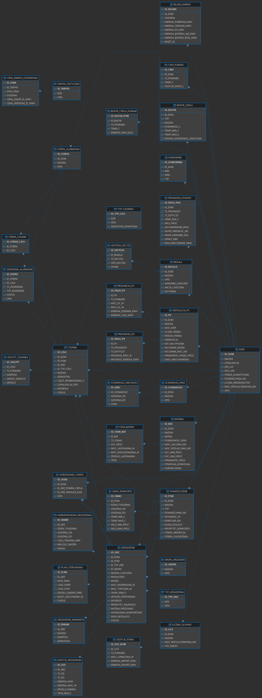
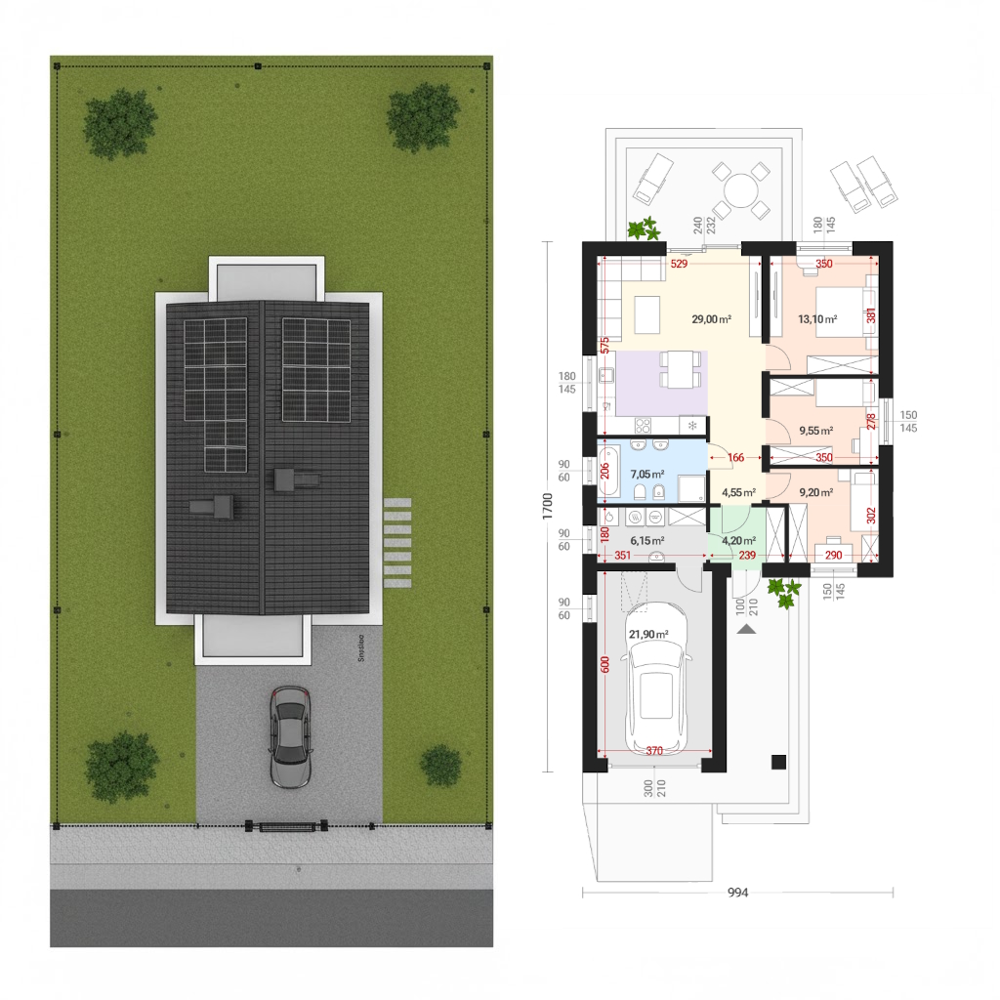

<h1 align="center">
  
  Struktura Danych Nowoczesnego Domu Jednorodzinnego w Firebird SQL
</h1>

Projekt przedstawia kompletną relacyjną strukturę danych dla nowoczesnego, inteligentnego domu jednorodzinnego, zaprojektowaną z myślą o zarządzaniu energią, komfortem, bezpieczeństwem oraz automatyką budynkową. System obejmuje m.in. obsługę urządzeń, czujników, pomieszczeń, fotowoltaiki, magazynu energii, taryf, reguł decyzyjnych oraz danych historycznych i prognostycznych.

Modelowany obiekt to parterowy dom jednorodzinny z garażem w bryle, zamieszkały przez 4 osoby, o powierzchni około 100 m², zlokalizowany w Tomaszowie Bolesławieckim. Projekt został przygotowany jako koncepcyjno–inżynierski model danych pod przyszłą implementację systemu EMS (*Energy Management System*).

---

##  Technologie i środowisko

- **Baza danych:** 
- **Środowisko projektowe:** 
- **Język zapytań:** 
- **Model danych:** 
- **Podejście projektowe:**  
  -  – uporządkowanie struktury tabel i ograniczenie redundancji  
  -  – zachowanie spójności relacyjnej między encjami  
  -  – realistyczny model danych przygotowany pod wdrożenie EMS  

---

##  Główne założenia projektu

Projekt został zaprojektowany tak, aby system mógł:

- monitorować zużycie energii elektrycznej w domu,
- rejestrować dane z czujników środowiskowych i bezpieczeństwa,
- obsługiwać instalację fotowoltaiczną oraz magazyn energii,
- zarządzać ogrzewaniem, CWU, chłodzeniem i buforami cieplnymi,
- uwzględniać dynamiczne ceny energii i taryfy,
- przechowywać prognozy pogody i prognozy produkcji PV,
- definiować scenariusze, harmonogramy i reguły działania,
- analizować historię decyzji systemu automatyki.

---

  
 Funkcje programu / struktury danych (kliknij, aby rozwinąć)

---

  
<strong>DOM</strong> – główna encja projektu (kliknij, aby rozwinąć)

Tabela nadrzędna całego systemu. Opisuje konkretny budynek i stanowi punkt odniesienia dla większości pozostałych tabel. Przechowuje podstawowe informacje o domu, takie jak nazwa, lokalizacja, współrzędne GPS, powierzchnia, liczba mieszkańców oraz moc przyłączeniowa.

---

  
<strong>BATERIA</strong> – konfiguracja magazynu energii (kliknij, aby rozwinąć)

Tabela opisuje magazyn energii elektrycznej zainstalowany w domu. Zawiera dane techniczne baterii, takie jak pojemność, maksymalna moc ładowania i rozładowania, zakres SoC, sprawność oraz domyślną strategię pracy.

---

  
<strong>STAN_BATERII</strong> – bieżący i historyczny stan baterii (kliknij, aby rozwinąć)

Przechowuje historyczne i aktualne stany pracy magazynu energii. Zawiera poziom naładowania, moce ładowania i rozładowania, źródło ładowania oraz tryb pracy baterii w czasie.

---

  
<strong>BILANS_ENERGII</strong> – zagregowany bilans energetyczny domu (kliknij, aby rozwinąć)

Tabela analityczna służąca do zapisu bilansu energetycznego w czasie. Pozwala określić, ile energii pobrano z sieci, oddano do sieci, wyprodukowano z PV, przekazano do baterii oraz jaki był całkowity koszt energii.

---

  
<strong>BUFOR_CIEPLA</strong> – konfiguracja magazynu ciepła (kliknij, aby rozwinąć)

Opisuje bufory ciepła wykorzystywane w domu, np. bufor CO, CWU lub podłogówki. Zawiera informacje o typie bufora, pojemności, temperaturach granicznych i możliwości wcześniejszego nagrzewania.

---

  
<strong>BUFOR_CIEPLA_POMIAR</strong> – pomiary temperatury i energii bufora (kliknij, aby rozwinąć)

Tabela przechowuje historyczne pomiary stanu bufora ciepła. Rejestruje temperaturę oraz szacowaną ilość zgromadzonej energii cieplnej.

---

  
<strong>TARYFA_STATYCZNA</strong> – definicje taryf energetycznych (kliknij, aby rozwinąć)

Tabela słownikowa zawierająca rodzaje taryf energetycznych, np. G11, G12 lub taryfę dynamiczną. Oddziela definicję taryfy od konkretnych cen godzinowych.

---

  
<strong>CENA_ENERGII_GODZINOWA</strong> – godzinowe ceny energii (kliknij, aby rozwinąć)

Przechowuje ceny zakupu i sprzedaży energii dla konkretnej taryfy, daty i godziny. Tabela jest kluczowa dla optymalizacji kosztów pracy urządzeń oraz strategii ładowania baterii.

---

  
<strong>CWU_POMIAR</strong> – parametry ciepłej wody użytkowej (kliknij, aby rozwinąć)

Służy do rejestrowania temperatury i zużycia ciepłej wody użytkowej. Pozwala analizować komfort domowników oraz zapotrzebowanie energetyczne systemu CWU.

---

  
<strong>REGULA</strong> – logika decyzyjna systemu (kliknij, aby rozwinąć)

Tabela przechowuje reguły sterujące inteligentnym domem. Definiuje warunki logiczne, akcje do wykonania oraz aktywność danej reguły.

---

  
<strong>HISTORIA_DECYZJI</strong> – historia decyzji automatyki (kliknij, aby rozwinąć)

Rejestruje decyzje podejmowane przez system na podstawie reguł. Umożliwia analizę działania automatyki, audyt oraz debugowanie zachowania systemu.

---

  
<strong>INSTALACJA_PV</strong> – konfiguracja instalacji fotowoltaicznej (kliknij, aby rozwinąć)

Opisuje parametry techniczne instalacji PV, takie jak moc, liczba paneli, orientacja, kąt nachylenia, model falownika oraz data uruchomienia.

---

  
<strong>PRODUKCJA_PV</strong> – rzeczywiste pomiary produkcji PV (kliknij, aby rozwinąć)

Przechowuje dane historyczne dotyczące pracy instalacji fotowoltaicznej. Rejestruje chwilową moc DC i AC oraz energię dzienną i całkowitą.

---

  
<strong>PROGNOZA_PV</strong> – prognozowana produkcja energii z PV (kliknij, aby rozwinąć)

Tabela zawiera prognozowaną moc i energię produkowaną przez instalację fotowoltaiczną. Umożliwia planowanie pracy urządzeń i optymalizację autokonsumpcji.

---

  
<strong>LICZNIK_GLOWNY</strong> – konfiguracja głównego licznika energii (kliknij, aby rozwinąć)

Opisuje główny licznik energii elektrycznej domu. Przechowuje dane identyfikacyjne, moc przyłączeniową oraz typ taryfy.

---

  
<strong>ZUZYCIE_DOMU</strong> – zużycie energii całego budynku (kliknij, aby rozwinąć)

Tabela rejestruje rzeczywiste zużycie energii elektrycznej przez cały dom. Zawiera dane o mocy chwilowej, imporcie i eksporcie energii.

---

  
<strong>PROGNOZA_POGODY</strong> – dane prognostyczne pogody (kliknij, aby rozwinąć)

Przechowuje prognozowane warunki pogodowe dla domu, m.in. temperaturę, wilgotność, zachmurzenie, wiatr, opady i nasłonecznienie. Dane te są wykorzystywane np. do prognoz PV i sterowania ogrzewaniem.

---

  
<strong>DOMOWNIK</strong> – użytkownicy domu (kliknij, aby rozwinąć)

Opisuje mieszkańców domu i ich podstawowe cechy, takie jak imię, wiek i typ domownika. Tabela wspiera modelowanie obecności, komfortu i profilu zużycia energii.

---

  
<strong>POMIESZCZENIE</strong> – opis pomieszczeń domu (kliknij, aby rozwinąć)

Przechowuje informacje o wszystkich pomieszczeniach w budynku. Obejmuje nazwę, typ, powierzchnię, wysokość, kubaturę, klasę izolacji oraz priorytet komfortu.

---

  
<strong>OKNO_KOMFORTU</strong> – warunki komfortu w czasie (kliknij, aby rozwinąć)

Definiuje przedziały czasowe oraz dopuszczalne zakresy temperatury i wilgotności w konkretnych pomieszczeniach. Wykorzystywane do sterowania komfortem cieplnym.

---

  
<strong>OGRZEWANIE_CONFIG</strong> – konfiguracja systemu ogrzewania (kliknij, aby rozwinąć)

Opisuje logiczną konfigurację źródeł ogrzewania w domu, np. pompy ciepła i grzałki elektrycznej. Stanowi podstawę dla dalszego sterowania systemem grzewczym.

---

  
<strong>URZADZENIE</strong> – urządzenia działające w domu (kliknij, aby rozwinąć)

Centralna tabela opisująca wszystkie urządzenia w systemie, np. AGD, urządzenia grzewcze, wykonawcze i energochłonne. Zawiera parametry techniczne, sposób sterowania, interfejs komunikacyjny i priorytety działania.

---

  
<strong>GRUPA_URZADZEN</strong> – grupowanie urządzeń (kliknij, aby rozwinąć)

Tabela służy do logicznego grupowania urządzeń w kategorie, np. AGD, ogrzewanie czy oświetlenie. Ułatwia raportowanie i sterowanie całymi grupami.

---

  
<strong>TYP_URZADZENIA</strong> – słownik typów urządzeń (kliknij, aby rozwinąć)

Przechowuje klasyfikację urządzeń według ich funkcji i charakteru pracy. Ułatwia rozszerzanie systemu oraz porządkowanie danych.

---

  
<strong>ZUZYCIE_URZADZENIA</strong> – zużycie energii przez urządzenia (kliknij, aby rozwinąć)

Tabela zawiera zagregowane dane o zużyciu energii przez poszczególne urządzenia w określonych przedziałach czasu. Umożliwia analizę energochłonności sprzętu.

---

  
<strong>URZADZENIE_PARAMETR</strong> – parametry konfiguracyjne urządzeń (kliknij, aby rozwinąć)

Tabela typu key–value przechowująca dodatkowe parametry urządzeń, które są zmienne, opcjonalne lub zależne od modelu. Pozwala elastycznie rozszerzać konfigurację urządzeń.

---

  
<strong>PLAN_STEROWANIA</strong> – zaplanowane akcje dla urządzeń (kliknij, aby rozwinąć)

Przechowuje konkretne zaplanowane działania sterujące dla urządzeń: moment startu, stopu, preferowane źródło energii oraz szacowany koszt wykonania.

---

  
<strong>HARMONOGRAM_URZADZENIA</strong> – powtarzalne zasady pracy urządzeń (kliknij, aby rozwinąć)

Tabela opisuje cykliczne harmonogramy działania urządzeń w wybranych dniach tygodnia i godzinach. Może uwzględniać np. minimalny poziom naładowania baterii.

---

  
<strong>SCENARIUSZ_DNIA</strong> – scenariusze funkcjonowania domu (kliknij, aby rozwinąć)

Definiuje gotowe tryby działania domu, np. dzień roboczy, weekend lub nieobecność. Scenariusze wpływają na urządzenia, reguły i harmonogramy.

---

  
<strong>SCENARIUSZ_OBECNOSC</strong> – model obecności domowników (kliknij, aby rozwinąć)

Opisuje przedziały czasowe obecności lub nieobecności mieszkańców w ramach konkretnego scenariusza dnia. Dane te wpływają na komfort, bezpieczeństwo i oszczędność energii.

---

  
<strong>CZUJNIK</strong> – konfiguracja czujników (kliknij, aby rozwinąć)

Centralna tabela warstwy pomiarowej. Opisuje wszystkie czujniki w systemie: środowiskowe, energetyczne i bezpieczeństwa, wraz z ich lokalizacją, jednostką i interfejsem komunikacji.

---

  
<strong>ODCZYT_CZUJNIKA</strong> – historyczne odczyty z czujników (kliknij, aby rozwinąć)

Przechowuje właściwe dane pomiarowe zbierane z czujników w czasie. Umożliwia analizę zmian parametrów środowiskowych, bezpieczeństwa i zużycia energii.

---

  
<strong>TYP_CZUJNIKA</strong> – słownik rodzajów czujników (kliknij, aby rozwinąć)

Tabela definiuje typy czujników, np. temperatura, ruch, zalanie czy dym. Zapewnia spójność opisu i interpretacji danych pomiarowych.

---

  
<strong>STREFA_ALARMOWA</strong> – logiczne strefy systemu alarmowego (kliknij, aby rozwinąć)

Opisuje podział domu na strefy alarmowe, np. garaż, parter czy ogród. Ułatwia grupowanie zdarzeń oraz konfigurację systemu bezpieczeństwa.

---

  
<strong>STREFA_CZUJNIK</strong> – przypisanie czujników do stref alarmowych (kliknij, aby rozwinąć)

Tabela łącznikowa przypisująca konkretne czujniki do wybranych stref alarmowych. Dzięki niej system wie, które sensory należą do której strefy.

---

  
<strong>ZDARZENIE_ALARMOWE</strong> – historia zdarzeń alarmowych (kliknij, aby rozwinąć)

Przechowuje log zdarzeń alarmowych wykrytych w domu. Rejestruje czas, strefę, czujnik, typ zdarzenia, status obsługi i dodatkowy opis.

---

##  Cechy projektu

- modularna i czytelna struktura relacyjna,
- logiczne powiązania między encjami,
- przygotowanie pod EMS i automatykę domową,
- możliwość rozbudowy o nowe urządzenia, czujniki i scenariusze,
- obsługa danych historycznych oraz prognostycznych,
- możliwość dalszej implementacji algorytmów optymalizacyjnych.

---

##  Przykładowe obszary modelu danych

Projekt obejmuje między innymi:

- zarządzanie domem i jego parametrami,
- zarządzanie pomieszczeniami i komfortem,
- rejestrację danych z czujników,
- sterowanie urządzeniami,
- bilans energetyczny,
- fotowoltaikę i magazyn energii,
- system alarmowy,
- scenariusze i reguły automatyki,
- prognozy pogody i prognozy PV.

---

  
 Podgląd projektu domu (kliknij, aby rozwinąć)

Poniżej znajdują się materiały graficzne powiązane z projektem:

### Schemat relacyjny bazy danych

### Rzut i wizualizacja przykładowego nowoczesnego domu

